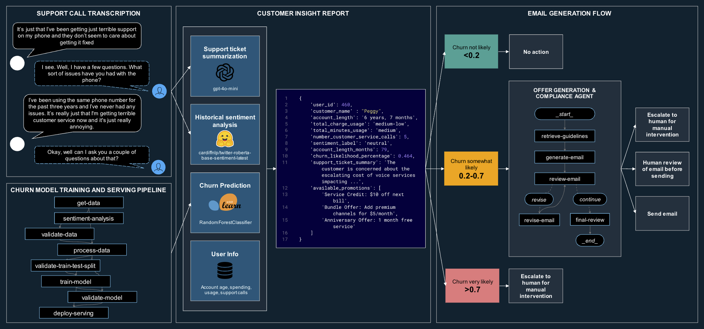
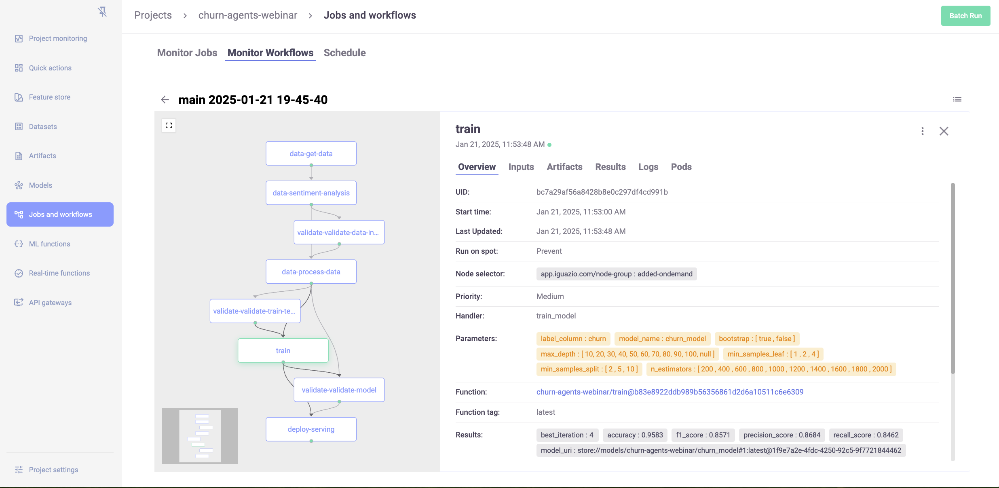
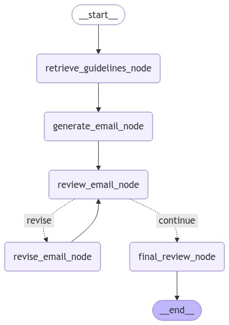

# AI Agent for Predictive Customer Retention

This demo was built for the MLOps Live Webinar 34 - Agentic AI Frameworks: Bridging Foundation Models and Business Impact

## Overview

In this demo, we build a solution for predictive customer retention using a combination of Traditional ML and Generative AI.

The goal is to:
1. Build a training and serving pipeline to predict customer churn propenity
1. Create a customer insight report that incudes churn score, sentiment analysis, summarization of previous support calls, and other various data
1. Create an agentic workflow that fetches style/compliance guidelines, generates a promotional email, reviews and revises in an evaluator-optimizer loop, and makes a final compliance routing on whether to send, review, or escalate up to a human.



## Getting Started

If you want to run `01_churn_ml_model.ipynb`,  `02_customer_insight_report.ipynb`, and `03_offer_generation_agent.ipynb`:
1. [Install MLRun Community Edition on Kubernetes for Docker Desktop](https://docs.mlrun.org/en/latest/install/kubernetes.html)
1. Clone [this repo](https://github.com/igz-us-sales/churn-agents-webinar) within the provisioned Jupyter service
1. Within Jupyter service, create conda environment using `make conda-env` (or `make conda-env-uv` if you have `uv` installed for faster depdency resolution)
1. Create `.env` file with your OpenAI credentials
1. Create Jupyter kernel with `python -m ipykernel install --user --name churn-v2`
1. Run notebooks in order (note: OpenAI credentials required to run `03_offer_generation_agent.ipynb`)

If you just want to run `03_offer_generation_agent.ipynb`:
1. Clone [this repo](https://github.com/igz-us-sales/churn-agents-webinar) within your environment
1. Within your environment, create conda environment using `make conda-env` (or `make conda-env-uv` if you have `uv` installed for faster depdency resolution)
1. Create `.env` file with your OpenAI credentials
1. Create Jupyter kernel with `python -m ipykernel install --user --name churn-v2`
1. Run`03_offer_generation_agent.ipynb` (note: OpenAI credentials required)

## Modules

### Churn Model Training and Serving Pipeline

Full training and serving pipeline that includes the following components:
- `get-data`: retrieve dataframe and log in experiment tracking
- `sentiment-analysis`: Calculate sentiment over dataframe in batches and log (uses [cardiffnlp/twitter-roberta-base-sentiment-latest](https://huggingface.co/cardiffnlp/twitter-roberta-base-sentiment-latest) model)
- `validate-data`: uses [Data integrity suite from Deepchecks](https://docs.deepchecks.com/stable/tabular/auto_tutorials/quickstarts/plot_quick_data_integrity.html)
- `process-data`: feature engineering using [sklearn pipeline](https://scikit-learn.org/stable/modules/generated/sklearn.pipeline.Pipeline.html)
- `validate-train-test-split`: uses [Train test validation suite from Deepchecks](https://docs.deepchecks.com/stable/tabular/auto_tutorials/quickstarts/plot_quick_train_test_validation.html)
- `train-model`: uses [sklearn RandomForestClassifier](https://scikit-learn.org/stable/modules/generated/sklearn.ensemble.RandomForestClassifier.html) and [MLRun hyperparameter tuning](https://docs.mlrun.org/en/latest/cheat-sheet.html#hyperparameter-tuning)
- `validate-model`: uses [Model evaluation suite from Deepchecks](https://docs.deepchecks.com/stable/tabular/auto_tutorials/quickstarts/plot_quick_model_evaluation.html)
- `deploy-serving`: uses [MLRun real-time model serving](https://docs.mlrun.org/en/latest/serving/model-serving-get-started.html)



### Customer Insight Report

Create report on customer to be used as input to our offer generation and compliance agent which includes the following components:
- Data formatting for human readable text (e.g. 49 months to 4 years, 1 month)
- Churn inference from our newly trained and deployed model
- Support ticket summarization via `gpt-4o-mini`
- Get available promotions via rule-based engine
- Fetch pre-computed features including sentiment, account length, charge/minutes usage, number of support tickets, etc.

Example:
```python
get_customer_insight_report(user_id=2296)

{
    'user_id': 460,
    'customer_name' : "Peggy",
    'account_length': '6 years, 7 months',
    'total_charge_usage': 'medium-low',
    'total_minutes_usage': 'medium',
    'number_customer_service_calls': 5,
    'sentiment_label': 'neutral',
    'account_length_months': 79,
    'churn_likelihood_percentage': 0.464,
    'support_ticket_summary': 'The customer is concerned about the escalating cost of voice services impacting turnover and is looking for alternative options, but hangs up before the TelCom agent can provide further assistance.',
    'available_promotions': [
        'Service Credit: $10 off next bill',
        'Bundle Offer: Add premium channels for $5/month',
        'Anniversary Offer: 1 month free service'
    ]
}
```

### Offer Generation and Compliance Agent

Agentic workflow built using [LangChain](https://python.langchain.com/docs/introduction/) and [LangGraph](https://langchain-ai.github.io/langgraph/). Implements agentic workflow design patterns including prompt-chaining and evaluator-optimizer loop.

Includes the following components:
- `OverallState`: shared graph state using [Pydantic model](https://docs.pydantic.dev/latest/) (allows for data validation per step)
- `retrieve_guidelines_node`: Retrieve style and compliance guidelines from in memory [Chroma vector store](https://python.langchain.com/docs/integrations/vectorstores/chroma/) using vector store retriever. Logs guidelines in graph state.
- `generate_email_node`: Generates email using customer insigh report and style/compliance guidelines. Logs generated email in graph state.
- `review_email_node`: Simulates customer feedback to generated email using customer insight report as well as gathers compliance feedback using compliance guidelines. Logs feedback and whether revision is required in graph state.
- `should_revise`: Conditional edge that decides whether to route to revision or to continue onto final output (based on maximum number of revisions and output of `review_email_node`)
- `revise_email_node`: Revise generated email using original email, customer insight report, customer/compliance feedback, style/compliance guidelines. Logs revised email and number of remaining revisions.
- `final_review_node`: Route email into pass (send email automatically), review (human review before sending), or fail (escalate up to human to take over). Logs final routing and reasoning.




## Challenges and Lessons Learned
### What did not work?
- LangChain issues
    - "Over-abstractions" made small, simple changes very difficult
        - Note: [Anthropic article](https://www.anthropic.com/research/building-effective-agents) recommends NOT starting with frameworks in favor of raw Python
    - "Legacy" LangChain agents do not allow you to combine ReAct prompting with tool calling in an easy way (e.g. `from langchain.agents import create_tool_calling_agent, create_react_agent`)
    - State management
        - Managing state and shared context is notoriously difficult in LangChain
        - The agent was unable to reliably take information from previous tool calls (e.g. style guidelines) and use them in future tool calls in the correct format
- Control flow
    - Fully autonomous agent was difficult to guide in the right direction, even with experimentation and revision of prompt and tool descriptions
    - Note: [Anthropic article](https://www.anthropic.com/research/building-effective-agents) talks about how prompt engineering of tools is just as / more important than the system prompt
    - Note: Plan and execute agent helped, but it was difficult to
        1. Ensure the agent reviewed and revised the generated content before returning
        1. Ensure the agent used my specific "review" tool rather than just review by itself

### What worked?
- Combination of Traditional ML and Generative AI
    - Allowed for using the best tool for the job (e.g. traditional ML model for churn) to create a context for the LLM to receive and use during generation
    - Separation of concerns
    - Modular
- Switch from autonomous "Agent" to Agentic "Workflow"
    - Ensures certain steps are followed (e.g. review and revise)
    - Provides an upper bound estimate for cost and latency
    - Keeps implementation simpler
    - Note: This use case has a fairly well-defined flow and series of subtasks
- Switch from pure LangChain to LangGraph
    - Full low-level control over nodes and what happens in each step
    - Full control over the routing and conditional logic
    - Simple state management - each node receives a shared graph state (dictionary or Pydantic model)
    - Can be compiled as a LangChain runnable and used in an existing chain

## References
- [Building Effective Agents - Anthropic](https://www.anthropic.com/research/building-effective-agents)
- [Agents - Chip Huyen](https://huyenchip.com/2025/01/07/agents.html)
- [The DNA of AI Agents: Common Patterns in Recent Design Principles - Cedric Chee](https://cedricchee.com/blog/the-dna-of-ai-agents/)